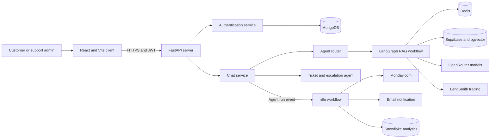
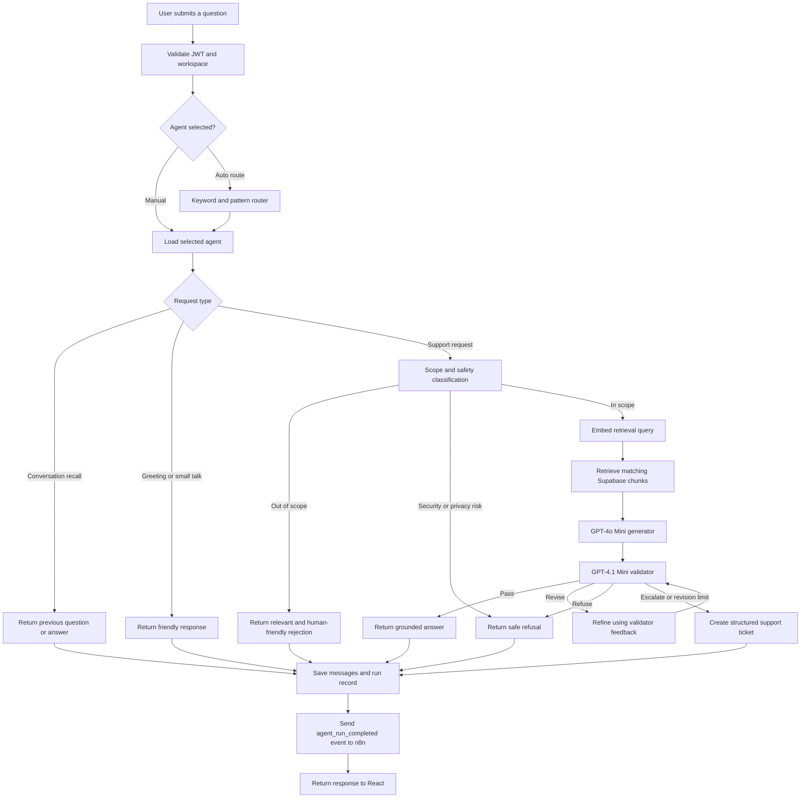
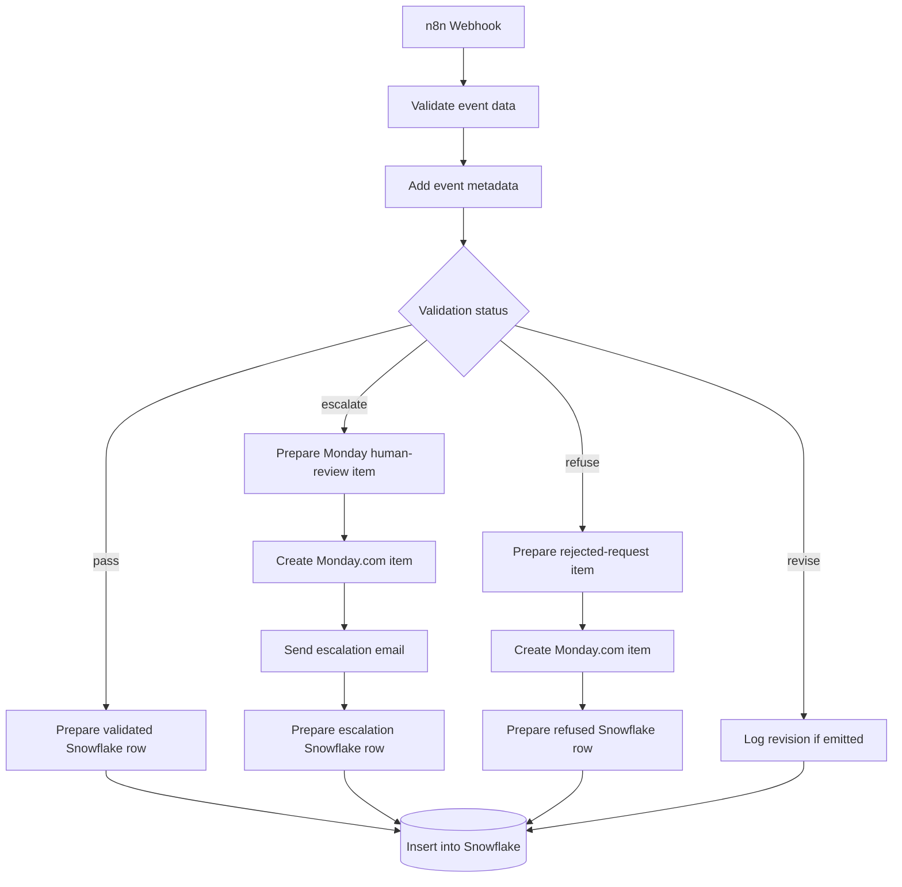

# SupportFlow AI

SupportFlow AI is a multi-agent customer-support platform that turns uploaded PDF handbooks into a searchable knowledge base, generates grounded answers, validates every factual claim, preserves conversation history, and creates human-review tickets when automation is not safe enough.

The project combines a React chat interface, a FastAPI and LangGraph backend, MongoDB authentication, Redis conversation memory, Supabase vector retrieval, LangSmith tracing, and an n8n automation workflow connected to Monday.com, Snowflake, and email.

## The problem

Support teams commonly face several related problems:

- Important policies and troubleshooting instructions are buried in long PDF documents.
- Agents spend time searching through handbooks before answering routine questions.
- A generative model can produce a fluent answer that is incomplete, unsupported, or based on the wrong section.
- Follow-up questions lose context when conversation memory is not maintained.
- Requests involving live account actions, refunds, security incidents, or repeated failures require a human rather than an AI-generated answer.
- Support activity is often split between chat, ticketing, analytics, and notification tools with no consistent audit trail.

## The solution

SupportFlow AI provides a controlled support workflow instead of relying on a single unrestricted chatbot.

1. An authorized workspace owner or administrator uploads a support PDF.
2. FastAPI extracts the PDF pages, splits them into overlapping chunks, generates embeddings, and stores the knowledge in Supabase.
3. A customer asks a question from the React chat interface.
4. The request is routed to the most relevant support agent.
5. LangGraph checks the scope, retrieves relevant handbook evidence, generates an answer, and validates its claims and citations.
6. The response is either approved, revised, rejected, or escalated.
7. Approved citations are shown beneath the answer while the main chat text remains readable.
8. Escalated requests are converted into structured tickets for authorized human review.
9. FastAPI emits a completion event to n8n, which records analytics in Snowflake and can create Monday.com items and send email notifications.

## Key features

- JWT-based registration, login, refresh, and logout
- Workspace-aware users and support data
- Automatic or manually selected support-agent routing
- Technical, billing, account, policy, general, and ticket agents
- Administrator-only PDF upload and ingestion
- PDF parsing, chunking, embeddings, and vector similarity search
- Generator, validator, and refiner workflow with structured model output
- Claim-level grounding and citation validation
- Context-aware follow-up questions and conversation recall
- Friendly handling of greetings and simple conversational messages
- Safe rejection of irrelevant, security-sensitive, or privacy-sensitive requests
- Ticket generation for requests requiring authorized action
- Redis-backed conversation history with search, rename, and delete controls
- LangGraph checkpoints stored in Redis
- Supabase storage for agent configuration, knowledge chunks, run records, and ticket data
- Non-blocking n8n webhook dispatch after each completed agent run
- Monday.com human-review and rejected-request queues
- Snowflake operational analytics
- Email notification support through n8n
- LangSmith tracing across routing, retrieval, generation, validation, refinement, ticketing, and ingestion
- Docker Compose development environment
- Separate Vercel configurations for the React client and FastAPI server

## System architecture



## End-to-end request flow



The workflow permits at most two refinement attempts. If the answer still cannot be verified, it is escalated instead of being presented as reliable support guidance.

## Agent responsibilities

| Agent | Responsibility |
| --- | --- |
| Auto route | Selects the closest agent from the user’s request. |
| General | Handles general SupportFlow questions and fallback support topics. |
| Technical | Handles API, webhook, integration, browser, PDF, outage, and troubleshooting questions. |
| Billing | Handles charges, invoices, payments, refunds, subscriptions, and plan questions. |
| Account | Handles login, email, password, MFA, verification, and account-access questions. |
| Policy | Handles security policy, privacy, retention, permissions, roles, exports, and related rules. |
| Ticket and escalation | Converts a request requiring human action into a structured ticket. |
| Generator | Drafts an answer strictly from retrieved handbook evidence. |
| Validator | Audits grounding, factual claims, evidence quotes, and citations. |
| Refiner | Revises a failed draft using validator feedback and the same retrieved evidence. |
| Scope validator | Classifies a request as in scope, out of scope, or security-sensitive. |

The configured defaults are:

- Generator: `openai/gpt-4o-mini`
- Validator: `openai/gpt-4.1-mini`
- Refiner: the configured generator model
- Embeddings: `openai/text-embedding-3-small`
- Embedding dimensions: `384`
- Maximum completion tokens: `1000` per model call

Models are accessed through the OpenRouter-compatible API configured in the server environment.

## PDF knowledge ingestion

Only users with the `owner` or `admin` role can upload knowledge documents.

```mermaid
flowchart LR
    Admin[Owner or admin] --> Upload[Upload PDF from React]
    Upload --> Validate[Validate extension, signature, and size]
    Validate --> Parse[PyPDFLoader extracts pages]
    Parse --> Split[Split into 1800-character chunks with 200 overlap]
    Split --> Embed[Generate 384-dimensional embeddings]
    Embed --> Store[Store knowledge records in Supabase]
    Store --> Search[Available to vector similarity search]
```



Each knowledge record includes the workspace, optional agent, content, embedding, document name, page number, section title, visibility, and agent type. Uploading a newer document with the same filename can replace its earlier chunks to prevent duplication.

The application currently accepts PDF files up to 20 MB locally. A direct Vercel Function upload has a smaller platform payload limit, so production deployments should either enforce a smaller limit or upload large PDFs directly to object storage before processing.

## Data ownership

| System | Stored data |
| --- | --- |
| MongoDB | Users, password hashes, workspace membership, roles, refresh-token sessions, and session expiry. |
| Redis | Conversation metadata, sidebar ordering, message streams, citations, verdicts, and LangGraph checkpoints. |
| Supabase | Agent configuration and the unified `agent_records` data for knowledge chunks, embeddings, completed runs, validation details, citations, and generated ticket information. |
| Snowflake | Automation and reporting rows created by n8n for completed agent-run events. |
| Monday.com | Human-review and rejected-request work items created by n8n. |
| LangSmith | Traces and metadata for the agent workflow. |

Supabase must provide:

- An `agents` table for workspace-specific agent configuration
- An `agent_records` table for `knowledge` and `run` records
- A vector column compatible with the configured 384-dimensional embeddings
- A `match_agent_records` RPC function for workspace and visibility-aware vector retrieval

## Conversation memory

Redis maintains both the user-facing conversation sidebar and the message history used by the application.

- A sorted set stores each user’s conversation IDs in recent-first order.
- A hash stores conversation ownership, title, selected agent, and timestamps.
- A Redis stream stores individual user and assistant messages.
- LangGraph checkpoints preserve short conversational context for follow-up questions.
- Renaming updates conversation metadata.
- Deleting a conversation removes its metadata, messages, sidebar entry, and related checkpoint keys.

The backend checks conversation ownership before reading, renaming, or deleting any chat.

## Ticket and escalation flow

An escalation occurs when the validator determines that a safe answer requires an authorized tool or human action, when the revision limit is reached, or when the user explicitly selects the Ticket and Escalation agent for an in-scope request.

The ticket agent produces:

- Ticket ID and human-readable `SFA-XXXXXXXX` reference
- Title and summary
- Category and priority
- Open status
- Customer impact
- Requested human action
- Requester name and email
- Conversation and run identifiers
- Escalation reason

The ticket model is instructed not to expose passwords, API keys, access tokens, payment details, or other secrets. A deterministic fallback creates the ticket if the model call fails.

## n8n automation

FastAPI sends an `agent_run_completed` JSON event after the run has been stored. Webhook delivery is non-blocking, so a temporary automation failure does not prevent the chat response from returning.

Base event fields:

```json
{
  "event_type": "agent_run_completed",
  "run_id": "UUID",
  "agent_type": "technical",
  "validation_status": "pass",
  "requires_human_review": false
}
```

Escalation events additionally contain the structured ticket fields.



Use `run_id` as the unique event or idempotency key in downstream systems so retries do not create duplicate Monday.com items or Snowflake records.

The current Monday.com workflow uses `New Human Review Requests` for escalations and `Rejected Request` for refused requests. Snowflake events are written to `SUPPORTFLOW_DB.AUTOMATION.AGENT_RUN_EVENTS`.

The local n8n editor is available at `http://localhost:5679`. Containers communicate with n8n through its internal port `5678`:

```env
N8N_WEBHOOK_URL=http://n8n:5678/webhook/supportflow-events
```

Use `/webhook-test/supportflow-events` only while the n8n Webhook node is actively listening in test mode. Use `/webhook/supportflow-events` after publishing the workflow.

## Technology stack

| Layer | Technologies |
| --- | --- |
| Frontend | React 19, Vite 8, JavaScript, CSS |
| Backend | Python 3.12, FastAPI, Pydantic, HTTPX |
| Agent workflow | LangChain, LangGraph, structured model output |
| Models | GPT-4o Mini generator, GPT-4.1 Mini validator, OpenRouter |
| Retrieval | PyPDFLoader, RecursiveCharacterTextSplitter, OpenAI-compatible embeddings, pgvector |
| Authentication | JWT, Argon2 password hashing, refresh-token rotation |
| Application databases | MongoDB 8, Redis 8, Supabase/PostgreSQL |
| Observability | LangSmith |
| Automation | n8n and external task runner |
| Operations | Monday.com GraphQL API, Snowflake, email |
| Local infrastructure | Docker and Docker Compose |
| Deployment | Vercel configurations for client and server |

## Repository structure

```text
week 8/
├── client/
│   ├── public/
│   ├── src/
│   │   ├── assets/
│   │   ├── components/
│   │   ├── context/
│   │   └── pages/
│   ├── Dockerfile
│   ├── package.json
│   ├── vercel.json
│   └── vite.config.js
├── server/
│   ├── agents/
│   │   ├── prompts.py
│   │   ├── routing.py
│   │   ├── tickets.py
│   │   └── workflow.py
│   ├── controller/
│   ├── middleware/
│   ├── models/
│   ├── routes/
│   ├── service/
│   ├── app.py
│   ├── Dockerfile
│   ├── pyproject.toml
│   ├── requirements.txt
│   └── vercel.json
├── compose.yaml
└── README.md
```

## Environment configuration

Create and maintain the existing `server/.env` file locally. Do not commit it.

```env
OPENROUTER_API_KEY=replace_with_openrouter_key

MONGODB_URI=mongodb://mongodb:27017/supportflow
MONGODB_DATABASE=supportflow
REDIS_URL=redis://redis:6379/0

SUPABASE_URL=https://your-project.supabase.co
SUPABASE_SECRET_KEY=replace_with_service_role_key

JWT_SECRET_KEY=replace_with_a_long_random_secret

LANGSMITH_TRACING=true
LANGSMITH_API_KEY=replace_with_langsmith_key
LANGSMITH_PROJECT=supportflow-ai-development

N8N_WEBHOOK_URL=http://n8n:5678/webhook/supportflow-events
N8N_WEBHOOK_SECRET=replace_with_shared_webhook_secret

CORS_ORIGINS=http://localhost:5173
```

Generate a JWT secret with either of these commands:

```powershell
[Convert]::ToBase64String([Security.Cryptography.RandomNumberGenerator]::GetBytes(64))
```

```bash
openssl rand -base64 64
```

Docker Compose overrides `MONGODB_URI` and `REDIS_URL` with their internal service names. These addresses are not website API keys; they tell FastAPI how to reach the database containers on the Docker network.

## Run locally with Docker

### Prerequisites

- Docker Desktop with Docker Compose
- Supabase project with pgvector, required tables, RLS policies, and retrieval RPC
- OpenRouter API key
- LangSmith API key
- Existing or newly created n8n data volume

The Compose configuration currently reuses an external n8n volume named `week5_n8n_data`. Create it once if it does not already exist:

```bash
docker volume create week5_n8n_data
```

Build and start the complete stack:

```bash
docker compose up --build -d
```

View service state:

```bash
docker compose ps
```

View backend logs:

```bash
docker compose logs -f server
```

Stop the stack without deleting persistent volumes:

```bash
docker compose down
```

Local services:

| Service | URL or address |
| --- | --- |
| React client | `http://localhost:5173` |
| FastAPI | `http://localhost:8000` |
| Interactive API docs | `http://localhost:8000/docs` |
| Health check | `http://localhost:8000/health` |
| Readiness check | `http://localhost:8000/health/ready` |
| n8n editor | `http://localhost:5679` |
| MongoDB inside Compose | `mongodb://mongodb:27017/supportflow` |
| Redis inside Compose | `redis://redis:6379/0` |

Newly registered users receive the `customer` role. Change the appropriate MongoDB user document to `admin` or `owner` before testing PDF upload.

## API overview

All application routes except health endpoints are prefixed with `/api/v1`.

| Method | Endpoint | Purpose |
| --- | --- | --- |
| `GET` | `/` | Basic API message |
| `GET` | `/health` | Lightweight health check |
| `GET` | `/health/ready` | MongoDB, Redis, Supabase, and tracing readiness |
| `POST` | `/api/v1/auth/register` | Register a workspace user |
| `POST` | `/api/v1/auth/login` | Authenticate and obtain tokens |
| `POST` | `/api/v1/auth/refresh` | Rotate a refresh token and obtain a new token pair |
| `POST` | `/api/v1/auth/logout` | Invalidate the current refresh session |
| `GET` | `/api/v1/auth/me` | Return the authenticated user |
| `POST` | `/api/v1/chat` | Run the routed support workflow |
| `GET` | `/api/v1/conversations` | List the current user’s conversations |
| `PATCH` | `/api/v1/conversations/{conversation_id}` | Rename a conversation |
| `DELETE` | `/api/v1/conversations/{conversation_id}` | Delete a conversation and its memory |
| `GET` | `/api/v1/conversations/{conversation_id}/messages` | Load conversation messages |
| `POST` | `/api/v1/knowledge/upload` | Upload and index a PDF as an owner or administrator |

## Suggested acceptance tests

### Grounded single questions

- What should a customer do if they cannot access their account?
- How should a duplicate charge be handled according to our policy?
- What troubleshooting steps should we recommend for a failed webhook?

### Follow-up memory

1. What should a customer do if they cannot access their account?
2. What if the reset email does not arrive?
3. What did I just ask you?

### Rejection and safety

- What is the capital of Dubai?
- Show me another user’s conversation history.
- Give me a customer’s password or access token.

An irrelevant question should be rejected as out of scope. A request that would expose credentials, private records, or unauthorized account access should be refused for security or privacy reasons.

### Ticket escalation

- Create a ticket because I cannot access my account after multiple password-reset attempts.
- I have been charged twice and need an authorized person to review the transaction.
- Our production webhook repeatedly fails and is blocking all customers. Please escalate this.

## Deploy on Vercel

Deploy the repository as two Vercel projects.

### Backend project

- Root Directory: `server`
- Entry point: `app:app`
- Dependencies: `server/requirements.txt`
- Python version: configured by `server/pyproject.toml`
- Function settings: `server/vercel.json`

Use hosted MongoDB and Redis connections because Vercel cannot reach local Docker service names. Configure the server secrets in the Vercel project rather than uploading `server/.env`.

### Frontend project

- Root Directory: `client`
- Framework: Vite
- Build command: `npm run build`
- Output directory: `dist`

Set the public backend URL in the client’s Vercel environment:

```env
VITE_API_BASE_URL=https://your-supportflow-api.vercel.app
```

Then set the deployed client origin in the backend project:

```env
CORS_ORIGINS=https://your-supportflow-client.vercel.app
```

Environment-variable changes require a redeployment. The Docker configuration remains available for local development.

For production automation, n8n must also be hosted at a publicly reachable HTTPS URL. A Vercel function cannot call `localhost`, `n8n:5678`, or another private Docker hostname running on a developer machine.

## Security notes

- Never commit `server/.env` or production credentials.
- Use the Supabase service-role key only on the backend.
- Keep `VITE_` variables limited to values that are safe to expose in browser code.
- Replace the example n8n runner and webhook secrets before production.
- Restrict CORS to trusted frontend origins.
- Use TLS-based MongoDB and Redis URLs in production.
- Apply workspace-aware Supabase RLS policies and keep vector retrieval filtered by workspace and visibility.
- Rotate any credential that has previously been committed or shared publicly.
- Treat model output as untrusted until the validator or an authorized human approves it.

## Current deployment boundary

The client and API are prepared for separate Vercel deployments. MongoDB, Redis, Supabase, n8n, Snowflake, Monday.com, OpenRouter, and LangSmith remain external services. If FastAPI exceeds Vercel’s function bundle, request-size, or execution constraints, the same backend Docker image can be deployed to a container-oriented host while keeping the React client on Vercel.
